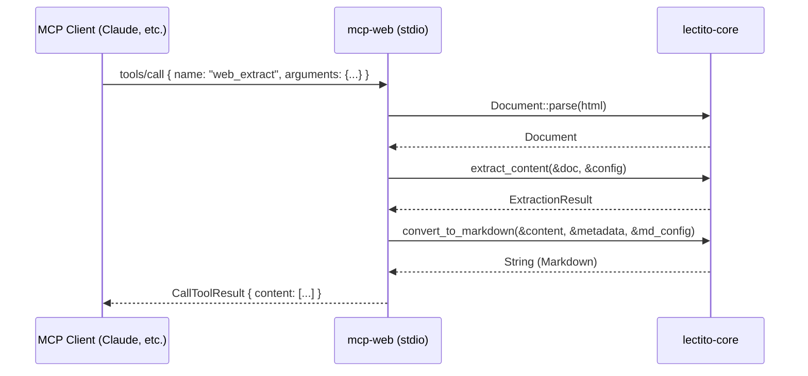

# Thunderus Web MCP Server

A local-first MCP server to give Thunderus a fast, reliable web search & deterministic "reader-mode" docs ingestion, with a durable SQLite cache and strict safety controls.

## Features/Constraints

- Transport: stdio first
    - MCP defines stdio + Streamable HTTP; clients should support stdio whenever
      possible.
- Search provider: Brave Search API
- Cache: SQLite, WAL mode, content-addressed by URL+headers hash.
- Output format: Markdown for extracted docs (LLM-friendly).
- Safety: SSRF protections, robots.txt respect, rate limits, and size caps.

## Diagrams



### Robots.txt

```text
┌─────────────┐     ┌────────────────────┐     ┌─────────────────┐
│  web_open   │────▶│  fetch robots.txt  │────▶│  RobotsTxt::    │
│  request    │     │  (cached 24h)      │     │  is_allowed()   │
└─────────────┘     └────────────────────┘     └─────────────────┘
                              │                         │
                              ▼                         ▼
                         Cache hit?                Allowed? Proceed
                    Return cached decision         Disallowed? Error
```

### Fetch

```text
┌──────────────┐    ┌───────────────┐    ┌──────────────┐
│ canonicalize │──▶ │ canonical_url │──▶ │ ssrf_check   │──▶ SSRF_BLOCKED
└──────────────┘    └───────────────┘    └──────┬───────┘
                                                ▼
                                         ┌──────────────┐
                                         │ robots_check │──▶ ROBOTS_DISALLOWED
                                         └──────┬───────┘
                                                ▼
                                         ┌───────────────┐
                                         │  reqwest.get  │──▶ HTTP_ERROR /
                                         └──────┬────────┘    FETCH_TIMEOUT /
                                                ▼             FETCH_TOO_LARGE
                                         ┌───────────────┐
                                         │ FetchResponse │
                                         └───────────────┘
```

### `web_open` Tool

```text
┌────────────┐     ┌──────────────┐     ┌────────────┐
│ web_open() │────▶│ cache lookup │────▶│ cache hit? │
└────────────┘     └──────────────┘     └──────┬─────┘
                                               │
                          ┌────────────────────┼──────────────────────┐
                          ▼                    ▼                      ▼
                       Cached          FetchClient.fetch()       Force refresh
                                                 │
                                                 ▼
                                          ┌──────────────┐
                                          │ Extractor    │
                                          │ .extract()   │
                                          └──────┬───────┘
                                                 ▼
                                          ┌──────────────┐
                                          │ normalize_   │
                                          │ markdown()   │
                                          └──────┬───────┘
                                                 ▼
                                          ┌──────────────┐
                                          │ cache upsert │
                                          └──────┬───────┘
                                                 ▼
                                              Response
```
